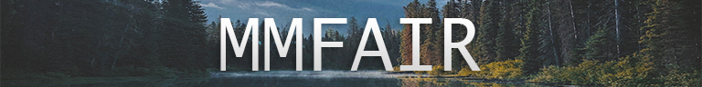

**Mixed Models for Agriculture in R**

```{r echo=FALSE, message=FALSE, warning=FALSE}
# packages for better formatting tables for html output
library(kableExtra); library(formattable)
library(dplyr); library(tibble); library(tidyr)
```

# Hi there!

This is a project under constrcution. Our aim is to provide a cookbook with mixed model analyses of typical examples in life sciences (focus on agriculture/biology) and compare the possibilities or rather limitations of the R-packages

* [`nlme`](https://CRAN.R-project.org/package=nlme){target="_blank"}
* [`lme4`](https://CRAN.R-project.org/package=lme4){target="_blank"}
* [`glmmTMB`](https://CRAN.R-project.org/package=glmmTMB){target="_blank"}
* [`sommer`](https://CRAN.R-project.org/package=sommer){target="_blank"}

to each other, but also to SAS' [`PROC MIXED`](https://documentation.sas.com/?docsetId=statug&docsetTarget=statug_mixed_syntax.htm&docsetVersion=14.3&locale=en){target="_blank"}.

<br/>

# Structure {.tabset .tabset-fade .tabset-pills}
Find chapters by navigating the menu at the top of the page. Each chapter focuses on a certain aspect of mixed modelling. Within each chapter, switch between tabs with codes from the different packages via these buttons:

## nlme
## lme4
## glmmTMB
## sommer
## SAS

# {.unlisted .unnumbered}

Additionally, find summaries at the top of the page for certain topics where we felt additional info may be beneficial, but should not bloat the chapters.

In terms of R syntax, we generally try to follow the approach presented on the ["R for Data Science" website](https://r4ds.had.co.nz/){target="_blank"}, making use of [dplyr](https://dplyr.tidyverse.org/){target="_blank"}, [tibbles](https://r4ds.had.co.nz/tibbles.html){target="_blank"} and [`%>%`-pipes](https://r4ds.had.co.nz/pipes.html){target="_blank"}.

<br/>

# Table of Contents

```{r echo=FALSE, message=FALSE, warning=FALSE}
contents <- rbind(
  c("R-side", "Heterogeneous err. var.", "yes", "no", "kind of", "in progress", "in progress"),
  c("R-side", "First-order autoregressive", "in progress", "in progress", "in progress", "in progress", "in progress"),
  c("R-side", "Fixed scalar (Smith's weights)", "in progress", "in progress", "in progress", "in progress", "in progress"),
  c("R-side", "Fixed matrix (fully efficient weighting)", "in progress", "in progress", "in progress", "in progress", "in progress"),
  c("G-side", "Fixed matrix (kinship/pedigree)", "in progress", "in progress", "in progress", "in progress", "in progress"),
  c("G-side", "Unstructured", "in progress", "in progress", "in progress", "in progress", "in progress"),
  c("G-side", "First-order factor analytic", "in progress", "in progress", "in progress", "in progress", "in progress"),
  c("ModelFit", "log-likelihood, AIC, BIC", "in progress", "in progress", "in progress", "in progress", "in progress"),
  c("ANOVA", "with DF adjustments", "in progress", "in progress", "in progress", "in progress", "in progress"),
  c("BLUPs", "raw/conditional predicted()", "in progress", "in progress", "in progress", "in progress", "in progress"),
  c("BLUEs", "raw/conditional emmeans()", "in progress", "in progress", "in progress", "in progress", "in progress"),
  c("Extract", "estimated R-side matrix", "in progress", "in progress", "in progress", "in progress", "in progress"),
  c("Extract", "estimated G-side matrix", "in progress", "in progress", "in progress", "in progress", "in progress"),
  c("Extract", "MMEq solutions", "in progress", "in progress", "in progress", "in progress", "in progress")

                  ) %>% data.frame


names(contents) <- c("Topic", "Chapter", "nlme", "lme4", "glmmTMB", "sommer", "SAS")

contents %>% 
  #mutate_at(vars(Topic:Chapter), ~cell_spec(., bold=TRUE)) %>% 
  mutate_at(vars(nlme:SAS), 
            ~cell_spec(., 
                       color=case_when(.=="in progress" ~ "orange", 
                                       TRUE ~ "white"),
                       background=case_when(.=="yes" ~ "green",
                                            .=="kind of" ~ "orange",
                                            .=="no" ~ "red",
                                            TRUE ~ "white"))) %>%
  kable(escape = FALSE) %>% 
  kable_styling(bootstrap_options = c("hover","responsive"),
                position = "left",
                full_width = FALSE) %>% 
  column_spec(1, bold = T) %>%
  collapse_rows(columns=1, valign = "top") %>% 
  add_header_above(c(" ", " ", "Possible in"=5))
```


